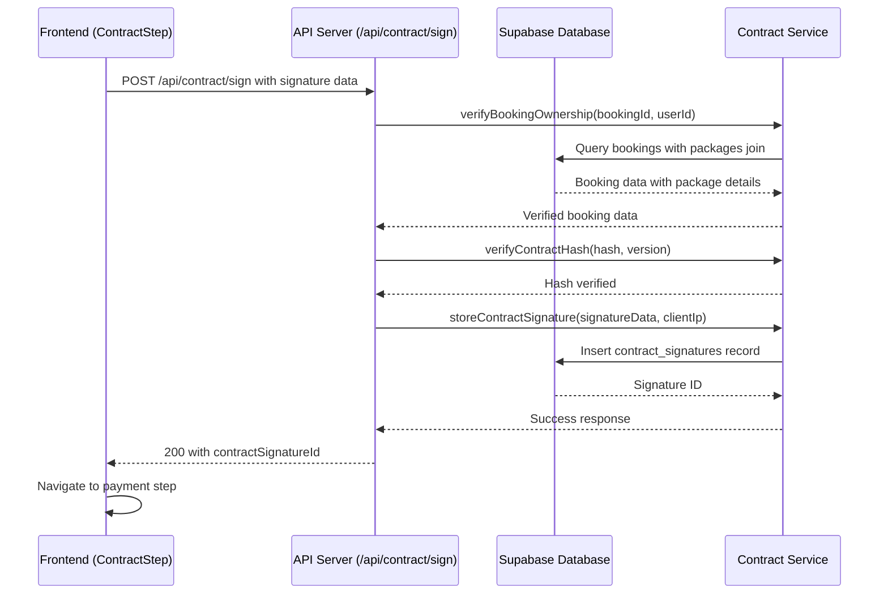

# Contract Signing Flow

## Overview

The contract signing flow allows customers to review and digitally sign photography contracts before proceeding to payment. This document outlines the complete flow, error handling, and recent bug fixes.

## System Architecture



## Database Schema

### Key Tables

**bookings**
- `id` (uuid, primary key)
- `customer_id` (uuid, foreign key to users)
- `package_id` (uuid, foreign key to packages)
- `venue_name` (text) - Event venue name
- `venue_address` (jsonb) - Structured address data
- `total_amount` (numeric)
- `contract_signed` (boolean)

**packages**
- `id` (uuid, primary key)
- `title` (text) - Package name (NOT `name`)
- `base_price` (numeric) - Package price (NOT `price`)

**contract_signatures**
- `booking_id` (uuid, foreign key)
- `signature_png_base64` (text)
- `signer_full_name` (text)
- `location` (text) - Derived from venue_name
- `ip_address` (text)
- `signed_at` (timestamptz)

## API Endpoints

### POST /api/contract/sign

**Request Body:**
```json
{
  "bookingId": "uuid",
  "contractVersion": "string",
  "contractHash": "string",
  "eventDate": "date",
  "location": "string",
  "packageName": "string",
  "price": "number",
  "signerFullName": "string",
  "signaturePngBase64": "data:image/png;base64,...",
  "signedAtISO": "datetime",
  "userId": "uuid"
}
```

**Response (Success - 200):**
```json
{
  "success": true,
  "contractSignatureId": "uuid",
  "message": "Contract signature recorded successfully",
  "timestamp": "datetime",
  "metadata": {
    "contractVersion": "string",
    "bookingId": "uuid",
    "signedAt": "datetime"
  }
}
```

**Error Responses:**

| Status | Code | Description |
|--------|------|-------------|
| 400 | MISSING_REQUIRED_FIELDS | Required fields missing |
| 400 | INVALID_SIGNATURE_FORMAT | Signature must be PNG base64 |
| 400 | SIGNATURE_TOO_LARGE | Signature exceeds 2MB limit |
| 401 | UNAUTHORIZED | Authentication required |
| 403 | BOOKING_ACCESS_DENIED | User doesn't own booking |
| 404 | BOOKING_NOT_FOUND | Booking ID invalid |
| 409 | CONTRACT_ALREADY_SIGNED | Contract already signed |
| 429 | RATE_LIMIT_EXCEEDED | Too many attempts |
| 500 | INTERNAL_ERROR | Server error |

## Frontend Flow

### ContractStep Component

**Location:** `src/pages/customer/booking/ContractStep.jsx`

**Key Features:**
- Contract document display
- Digital signature capture (canvas-based)
- Form validation
- Error handling with specific messages
- Retry logic (only for 5xx errors)
- Loading states

**State Management:**
```javascript
const [contractData, setContractData] = useState(null)
const [signatureData, setSignatureData] = useState({
  signaturePngBase64: null,
  signerFullName: '',
  consentAccepted: false
})
const [isSubmitting, setIsSubmitting] = useState(false)
const [submitError, setSubmitError] = useState(null)
```

**Validation Rules:**
- Signature canvas must have drawing
- Signer full name required
- Consent checkbox must be checked
- PNG format signature (base64)
- Maximum 2MB signature size

## Recent Bug Fixes

### Issue: "column packages_1.name does not exist"

**Root Cause:**
The ownership verification query in `contractService.js` was trying to select `name` and `price` from the `packages` table, but the actual column names are `title` and `base_price`.

**Fix:**
```javascript
// Before (causing error)
packages (
  id,
  name,    // ❌ Column doesn't exist
  price    // ❌ Column doesn't exist
)

// After (fixed)
packages (
  id,
  title as name,         // ✅ Correct column with alias
  base_price as price    // ✅ Correct column with alias
)
```

**Files Changed:**
- `src/lib/async/contractService.js` - Fixed query column names
- `api/server.js` - Updated field mapping for venue data

### Issue: Multiple Supabase Client Instances

**Root Cause:**
Multiple files were creating separate Supabase client instances, causing "Multiple GoTrueClient instances detected" warnings.

**Fix:**
Created a singleton pattern in `src/lib/supabaseClientSingleton.js` and updated all imports to use the singleton.

### Issue: Frontend Error Handling

**Improvements:**
- Don't retry 4xx errors (client errors)
- Provide specific error messages for different error codes
- Disable button during submission
- Better loading states

## Error Handling Strategy

### Client Errors (4xx) - No Retry
- Invalid request data
- Authentication/authorization issues
- Resource not found
- Rate limiting

### Server Errors (5xx) - Retry with Backoff
- Database connection issues
- Temporary service unavailability
- Internal server errors

### Error Message Mapping
```javascript
const errorMapping = {
  'BOOKING_ACCESS_DENIED': 'You don\'t have access to this booking.',
  'CONTRACT_ALREADY_SIGNED': 'This contract has already been signed.',
  'MISSING_REQUIRED_FIELDS': 'Invalid signature data. Please try signing again.',
  'RATE_LIMIT_EXCEEDED': 'Too many attempts. Please wait and try again.'
}
```

## Security Considerations

### Rate Limiting
- 5 requests per minute per IP address
- Prevents abuse and DoS attacks

### Data Validation
- Signature format validation (PNG base64)
- Size limits (2MB maximum)
- Required field validation
- SQL injection prevention

### Audit Trail
- All signing attempts logged with IP address
- Failed attempts tracked
- Comprehensive error logging

### Authentication
- User must be authenticated
- Booking ownership verification
- Session validation

## Testing

### Unit Tests
**Location:** `tests/unit/contractService.test.js`
- Database query validation
- Column name regression tests
- Error handling scenarios

### Integration Tests
**Location:** `tests/integration/contract-sign-endpoint.test.js`
- Complete API endpoint testing
- Error response validation
- Field mapping verification

### E2E Tests
**Location:** `tests/e2e/contract-signing-fix.spec.js`
- Full user flow testing
- Error state handling
- Regression prevention

## Monitoring and Debugging

### Audit Logs
All contract signing events are logged with structured data:
```javascript
auditLog('CONTRACT_SIGNED_SUCCESS', {
  signatureId: 'uuid',
  bookingId: 'uuid',
  contractVersion: 'string',
  processingTime: 'number'
}, clientIp)
```

### Health Check
```bash
GET /api/health
```
Returns contract service status and connectivity.

### Common Debug Commands
```bash
# Check database connectivity
curl http://localhost:3001/api/health

# Verify booking ownership query
supabase sql --query "
  SELECT b.id, b.customer_id, p.title as name, p.base_price as price
  FROM bookings b
  LEFT JOIN packages p ON p.id = b.package_id
  WHERE b.id = 'booking-id'
"
```

## Deployment Notes

### Environment Variables Required
- `SUPABASE_SERVICE_KEY` - Service role key for backend operations
- `SUPABASE_URL` - Project URL
- `VITE_SUPABASE_URL` - Frontend project URL
- `VITE_SUPABASE_ANON_KEY` - Frontend anonymous key

### Database Migrations
Ensure the following columns exist:
- `packages.title` (not `name`)
- `packages.base_price` (not `price`)
- `bookings.venue_name` and `venue_address` (not `location`)

### Performance Considerations
- Query timeout: 8 seconds for ownership verification
- Signature storage timeout: 12 seconds
- Rate limiting: 5 requests/minute per IP
- Maximum signature size: 2MB

## Troubleshooting

### Common Issues

**"Column does not exist" errors:**
- Verify database schema matches expected column names
- Check aliases in Supabase queries
- Ensure migrations are up to date

**"Multiple GoTrueClient" warnings:**
- Verify all imports use the singleton client
- Check for direct `createClient()` calls
- Ensure consistent client configuration

**Contract signing fails silently:**
- Check browser console for JavaScript errors
- Verify API endpoint availability
- Check authentication state
- Validate signature data format

**Rate limiting issues:**
- Implement exponential backoff
- Check IP address detection
- Consider user-based limiting

### Debug Checklist

1. ✅ Verify database schema (packages.title, packages.base_price)
2. ✅ Check Supabase client singleton usage
3. ✅ Validate authentication state
4. ✅ Confirm booking ownership
5. ✅ Verify signature format and size
6. ✅ Check API endpoint health
7. ✅ Review audit logs for errors
8. ✅ Test contract hash verification